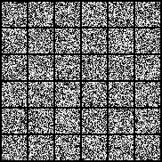
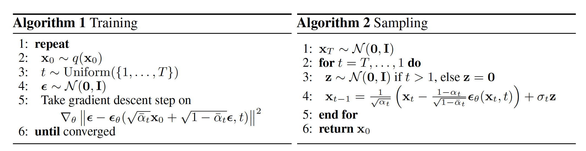
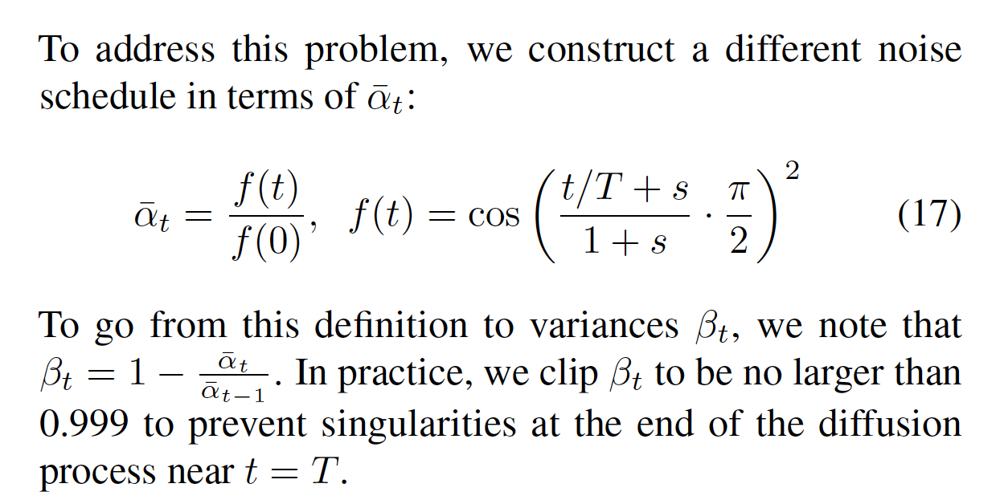

# DDPM-Pytorch


This repository contains a pytorch implementation of [DDPM(Denoising Diffusion Probabilistic Models)](https://arxiv.org/abs/2006.11239) which is mostly regarded as a standard diffusion model architecture.

To train the diffusion models better, this implementation reflects some modification introduced in [Improved DDPM](https://arxiv.org/abs/2102.09672).

For now, the code only supports **MNIST dataset** but soon is going to support **LSUN Bedroom dataset** as well.

## Key Idea

### DDPM
The code is following the formulas introduced in the DDPM paper strictly:




### Improved DDPM

According to the Improved DDPM paper, a noise scheduler can be redesigned as shown below:




## Training
Install packages
```bash
pip install -r requirements.txt
```
Start default setting training 
```bash
python train_mnist.py
```
Feel free to tuning training parameters, type `python train_mnist.py -h` to get help message of arguments.


## To-Do

- Adopting OmegaConfiguration such that the code supports various datasets

